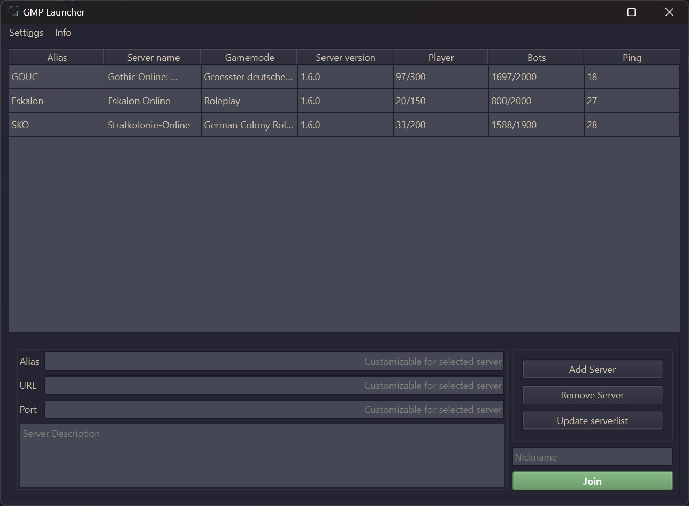

# Gothic Multiplayer Launcher (GML)
___

# Getting started

## Windows

- [Visual Studio 2022 (17.6 or newer)](https://visualstudio.microsoft.com/vs/) with C++ Toolchain and the English language pack
- [vcpkg](https://github.com/microsoft/vcpkg?tab=readme-ov-file#get-started) *(optional)*

Qt6 can be built with vcpkg (takes some time) or [installed](https://www.qt.io/product/qt6) as pre-build library.

### Build

After build go to the build folder and add `gmp/gmp.dll` into it.

## Debian/Ubuntu

```bash
sudo apt install cmake build-essential qt6-base-dev libssl-dev
```

### Build
```bash
cmake -S . -B build
cmake --build build --target gml --config Release
```
Go to the build folder and add `gmp/gmp.dll` into it. Also copy or cross compile `gmpinjector.exe`.

### Run
```bash
sudo dpkg --add-architecture i386
sudo apt update
sudo apt install wine wine32:i386 libqt6widgets6
chmod +x gmpinjector.sh
./gml
```
Adjust `gmpinjector.sh` if necessary.

To get windows-like path to your Gothic installation with winepath. In GML, set it under Settings => Options.
```bash
winepath -w "/path/to/gothic"
```
___
# Preview

___
# License
[MIT](LICENSE)
